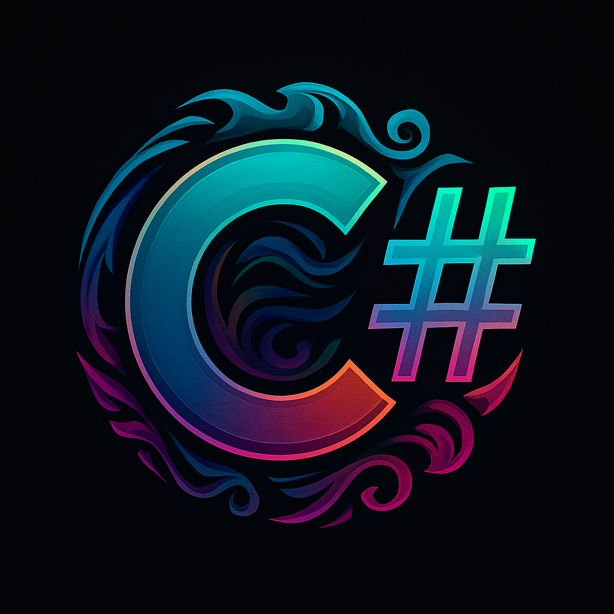

# 🎉 C# Console Projects Collection  

  

Welcome to **C# Console Projects Collection**! ✨  
This repository is a **bundle of mini C# console applications**, each focusing on a different concept or problem.😍💖  

---

## 📂 Projects Overview  

### 🧮 Calculator  
Perform basic arithmetic operations like **addition, subtraction, multiplication, and division** with colorful console output.  
**Features:** Input validation, prevents division by zero, repeat calculations.  

---

### 📐 Even or odd Checker  
Check if a number is **odd or even**, and also detect whether it’s **positive, negative, or zero**.  
**Features:** Interactive input, colorful output, error handling.  

---

### ✏️ Maximum and Minimum Digits App  
Find the **maximum and minimum digit** of any integer (positive or negative).  
**Features:** Handles negatives, colorful input/output, error handling.  

---

### 📒 Phone Book App  
Manage your phone contacts directly in the console. Add, edit, search, and delete contacts with data persistence.  
**Features:** File storage, input validation, search by name/number, colorful console UI.  

---

### ➕ Sum of Digits App  
Calculate the **sum of digits** of any integer (positive or negative).  
**Features:** Handles negatives, interactive console, colorful experience.  

---

### 🌡️ Temperature Converter  
Convert temperatures between **Celsius and Fahrenheit**.  
**Features:** Menu-driven console, colorful output, input validation, repeatable conversions.  

---

### 🌸 To-Do List App  
Track daily tasks with an easy console-based to-do list.  
**Features:** Add, mark as done, delete tasks, colorful UI.  

---

### 🌟 Unit Converter  
Convert between different **units of length** like meters, feet, inches, kilometers, and more.  
**Features:** Menu-driven interface, decimal support, error handling, colorful console UI.  

---

✨ Each project has its **own README** with detailed explanations, examples, and usage instructions.  
Enjoy exploring and happy coding! 💻💖  
